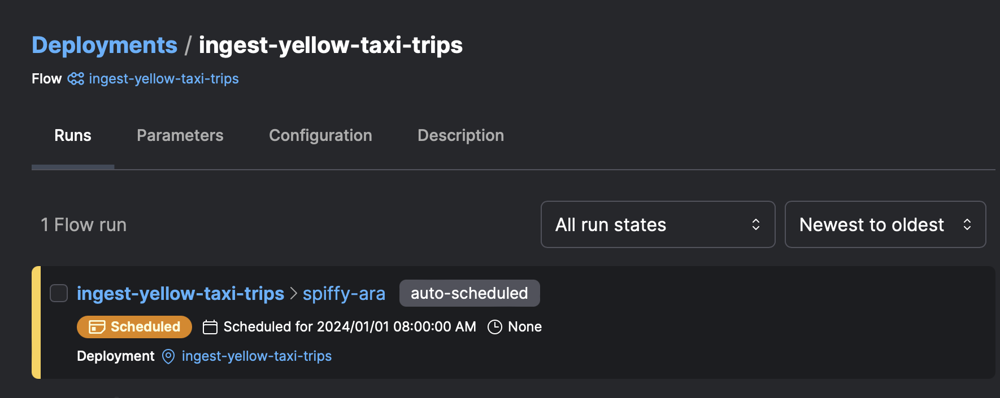
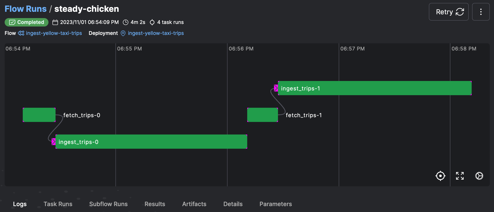
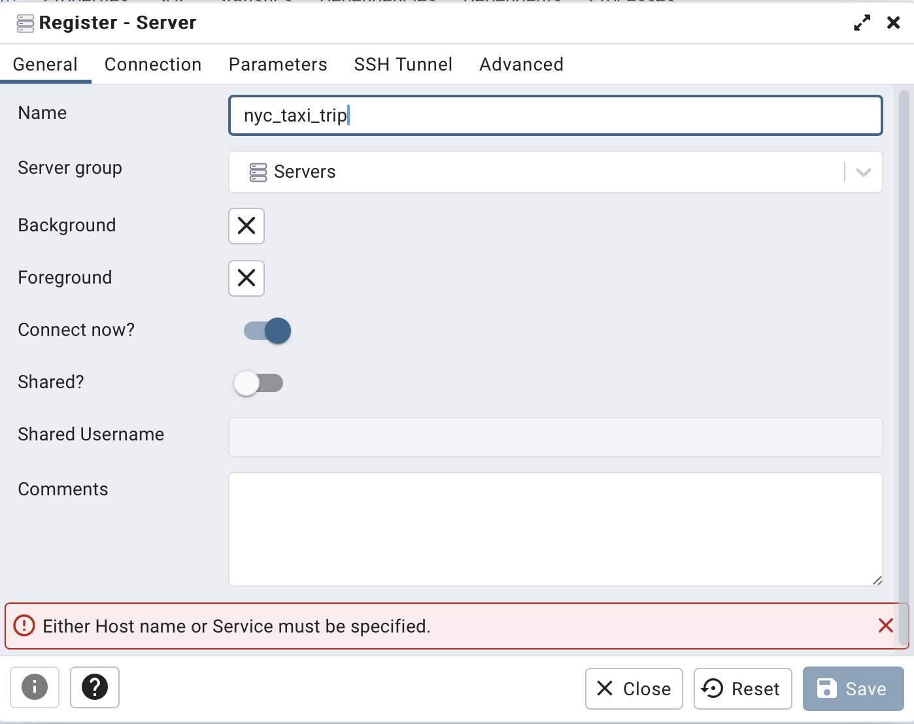
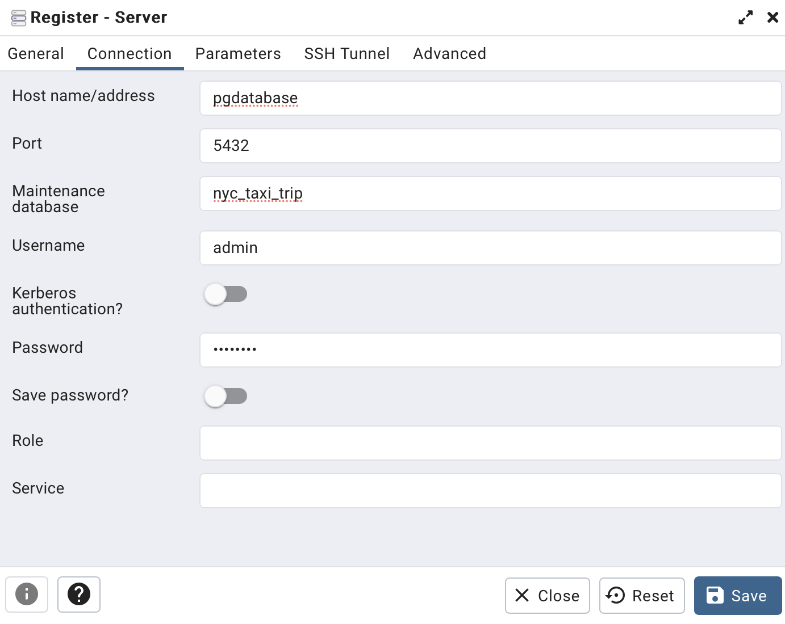
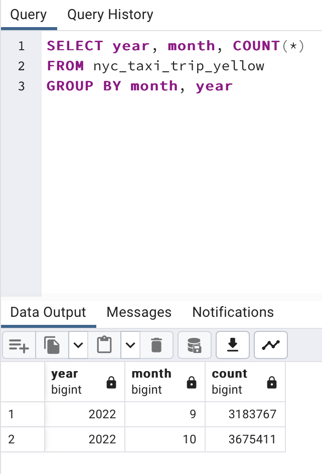
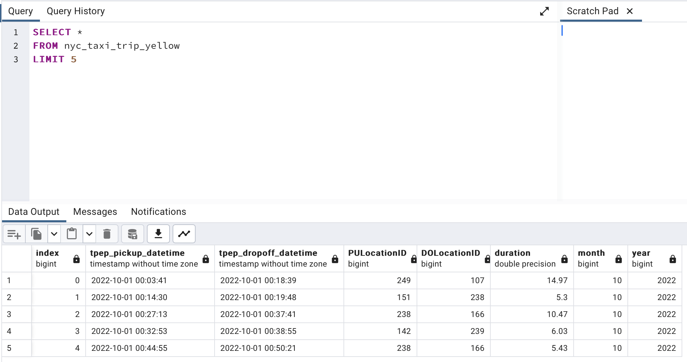

# Ingest NYC Taxi Data

This project's objective is to retrieve [TLC Trip Record Data](https://www.nyc.gov/site/tlc/about/tlc-trip-record-data.page) on a scheduled basis using Prefect. The collected data is then processed and stored in a PostgreSQL database. The orchestration of these services is managed through Docker Compose.

## Start the services

Start the services by running the commands within the root directory.

```bash
docker-compose build
docker-compose up -d
```

## Check the schedules in Prefect Server

Proceed to [http://localhost:4200](http://localhost:4200) and select the "Deployment" section. You'll find a scheduled task configured to run every two months on the first day of each month. This schedule aligns with the update frequency of the website. The task is designed to fetch data from the past two months. It's worth noting that, at present, the task retrieves data from the same month in the previous year since data for the current year is not yet available.

</p>

To manually execute the task, select *Run* followed by *Quick Run* in the upper-right corner of the task. After the task is complete, you can review the results and access the logs for further information.

</p>

## Check the data in PostgresSQL

To access the PostgreSQL data, navigate to [pgAdmin](http://localhost:8080). You can log in with the username `admin@admin.com` and the password `admin`. To register the server, please enter the information as indicated in the figures. Ensure that the server name matches the configuration provided in `docker-compose.yml`.

</p>
</p>

Once the server is registered, you can execute queries to verify that the data has been successfully stored in the database.

</p>
</p>

## Clean up

To stop the services, execute the following command in the root directory:

```bash
docker compose down --rmi all
```

This will stop and remove the images and containers defined in the Docker Compose configuration.
